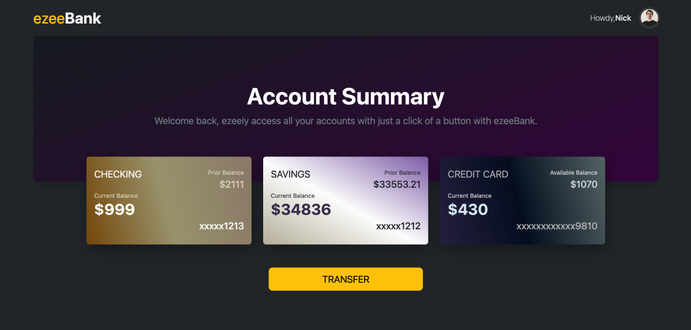

# Eezy Bank 

In this project you’ll build a simple Banking Portal with [Node](https://nodejs.org/docs/latest/api/) & [Express](https://expressjs.com/). There will be seven different routes that will include index, profile, savings, checking, credit, transfer and payment. We'll provide you with some starter code that includes several view templates. You'll use Node's built-in fs library to read and write data. We will also use the Express router to make the application more modular. 

## Table of contents

- [Overview](#overview)
  - [Screenshot](#screenshot)
  - [Links](#links)
- [Tech Stack](#tech-stack)
- [Author](#author)

## Overview

### Screenshot

### Links

- Code URL: [Github Repo.](https://github.com/mzwabantu/banking-portal)
- Live Site URL: [Eezy Bank](http://eezy.mzwwwa.co.za/)

## Tech stack

- NodeJS
- ExpressJS
- EJS
- Javascript
- HTML5
- CSS 
- Bootstrap 5

## Author

- Website - [Mzwabantu](https://mzwwwa.co.za/)
- LinkedIn - [mzwabantungubelanga](https://za.linkedin.com/in/mzwabantungubelanga)
- Dribbble - [MzwaN](https://dribbble.com/MzwaN)